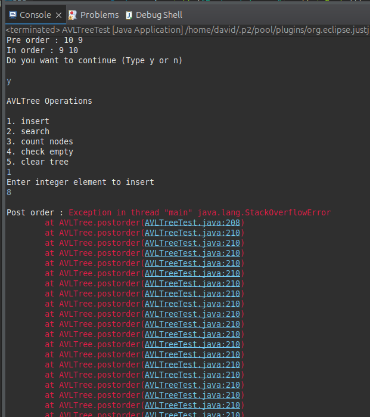
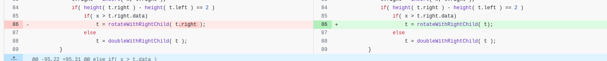

# HW1: debug an AVL tree 
> [題目要求](./debug%20AVL%20tree.docx)

## ANS: 
### bug1
* 原因：在輸入 8 的時候會發生錯誤
* 發生：不斷遞迴導致 stack overflow error. 

#### 修復
* bug1: `rotateWithLeftChild` 傳送的參數不正確

* bug2: `rotateWithLeftChild`, `rotateWithRightChild rotate 錯誤

