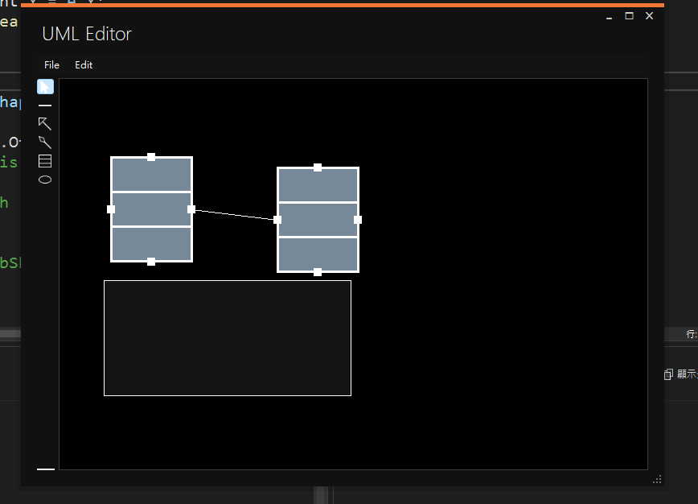
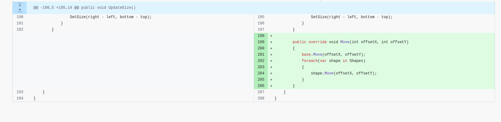
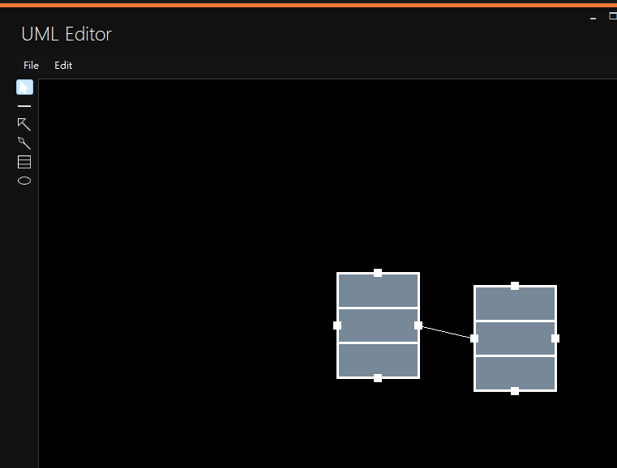
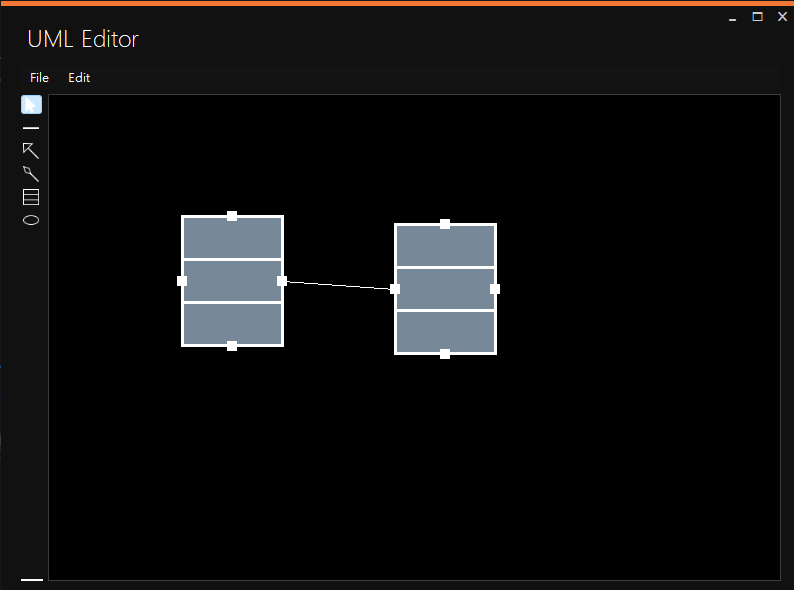
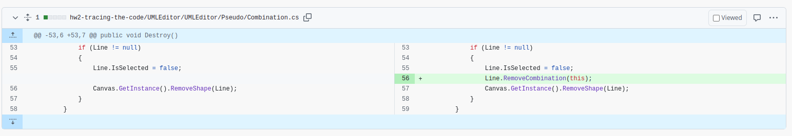
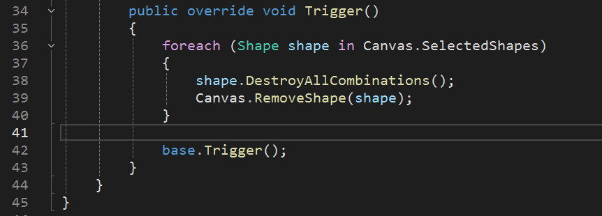
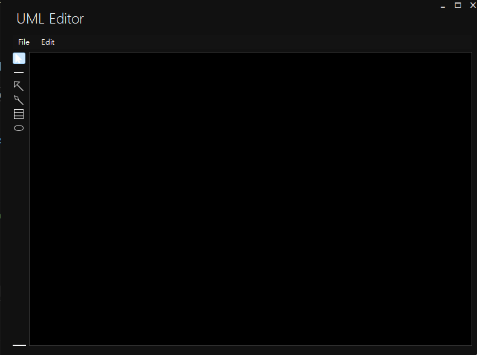
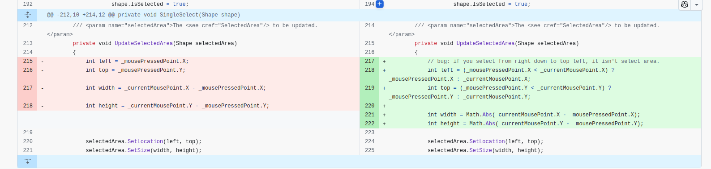
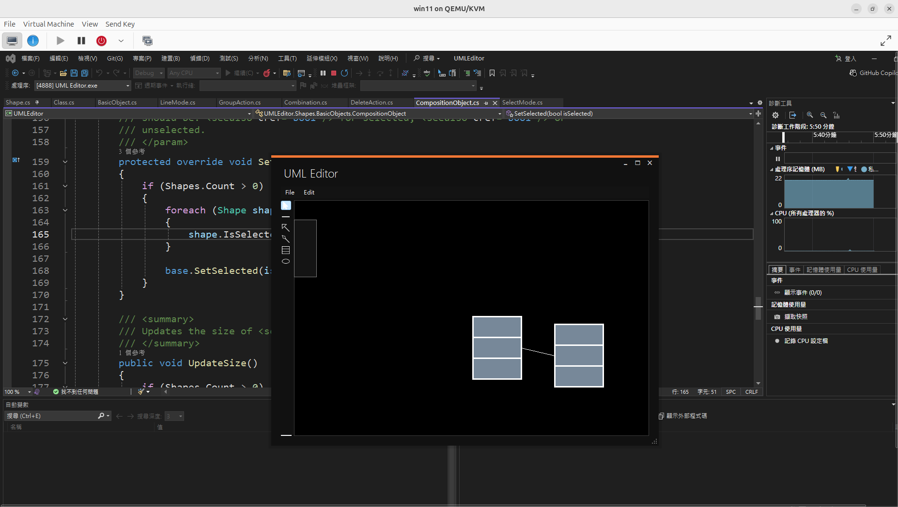

# HW2: tracing the code 
> 軟工碩一 113525011 江大衞
> [題目說明](./trace%20the%20code.odt)
> [題目要求](./UML%20editor%20requirement%20-%20use%20case%20format%20(1).odt)

## Bug1: UseCase E.1 在移動 group 時只有被匡起來的群組會移動，內部物件不會移動
* bug 示意圖
 
* bug 原因：`CompositionObject` 沒有去實做新的 `move` method，沿用了 `Shape` object 的 `move` 方法
* 如何修復
  * 對 `CompositionObject.cs/CompositionObject` 寫一個 override function，內容是讓 CompositionObject 裡面的物件也跟著進行移動
  * 
* 修復執行結果

## Bug2: UseCase G.2 在刪除物件的時候，會卡死，進入 infinite loop. 
* bug 示意圖

* 如何修復
在 `Combination.cs/Destory` function 中可以發現，實務上並沒有去刪除 line 這個 object, 導致 `DeleteAction.cs/trigger` function 沒有辦法成功 remove 要刪除的物件 
  * 刪除 line object bug 修復
  * 
  * 發現 trigger 無法被刪除的地方
  * 
* 修復執行結果

## Bug3: UseCase C.2 從左下往右上拉時，會無法選取
* bug 示意圖

* 如何修復
  * 確認 `_mousePressedPoint.X` 與 `_currentMousePoint.X` 誰更左邊的位置
  * 確認 `_mousePressedPoint.Y` 與 `_currentMousePoint.Y` 誰是更右角的位置
  * 
* 修復執行結果
  * 因為我是在 ubuntu 上開 qemu/kvm 虛擬機 windows 進行開發，無法將滑鼠拖曳時，進行節圖。
  * 附上使用 qemu/kvm 進行開發證明
  * 