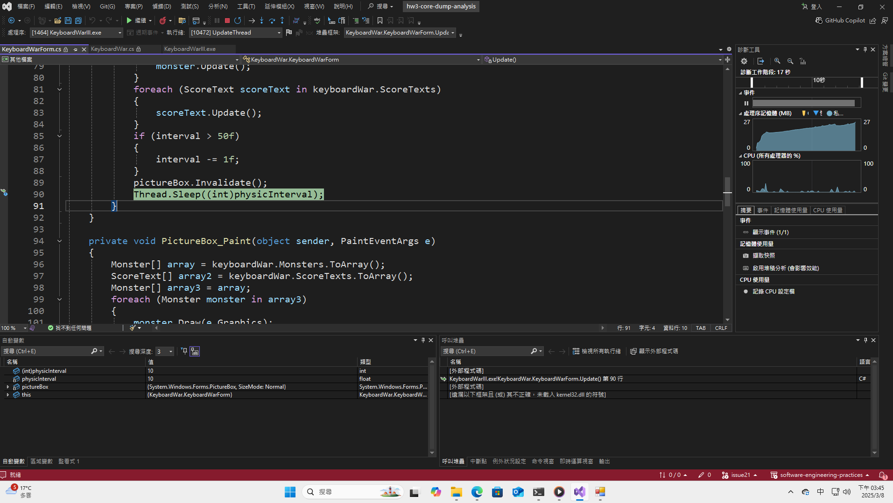
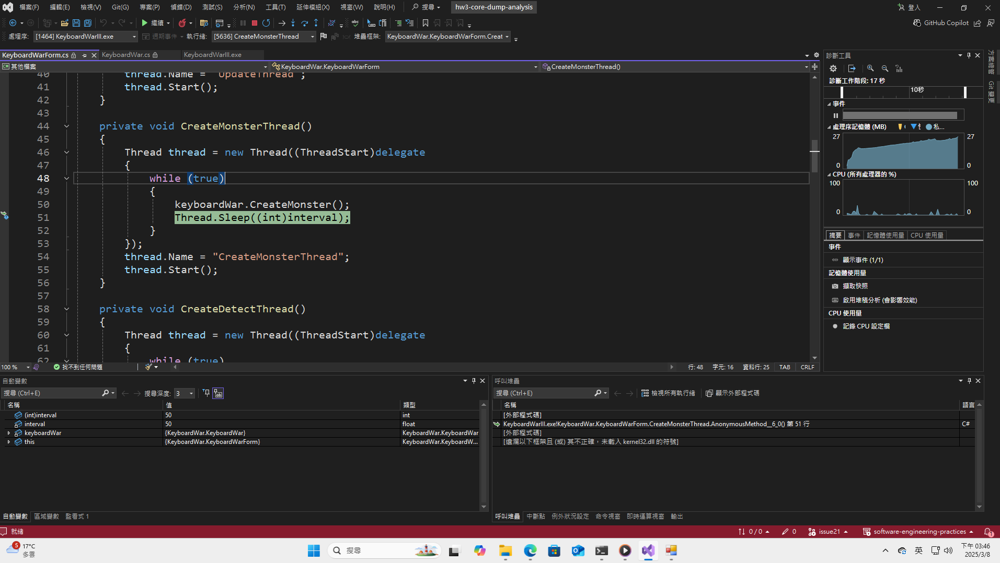
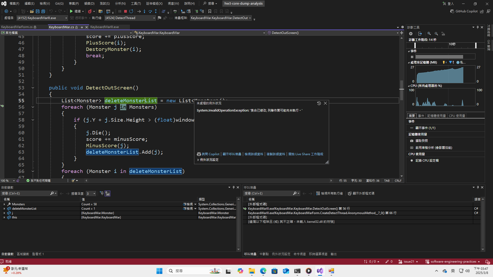
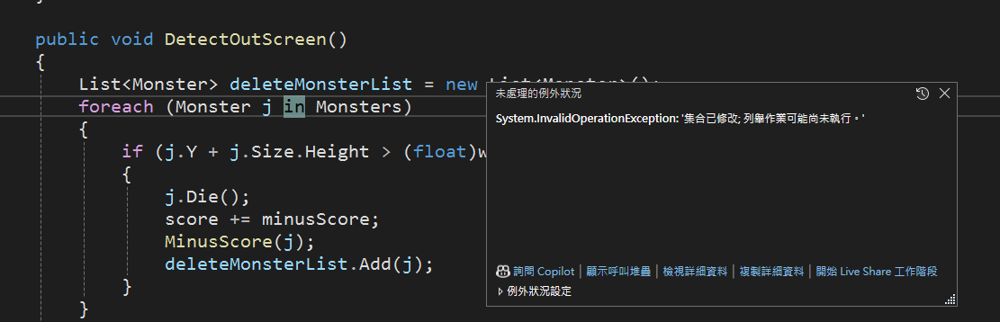
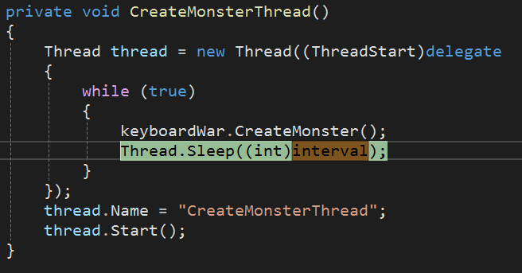

# HW3 Release bugs (core dump analysis)
## Successfully produce the screenshots as described 
* UpdateThread

* CreateMonsterThread

* DetectThread

## explain the possible causes of the bug at your best by examining the information from your dump analysis.
* 主要的問題點在於，`DetectOutScreen` 中的 Monsters 在 foreach 時不允許被其他 thread 修改 Monsters 這個 object. 
  
* 其中是因為 `CreateMonsterThread` 會對 Monsters 新增一個 monster

* 故此, 只要剛好在 `DetectOutScreen` 做 foreach 時, `CreateMonsterThread` 剛好去 CreateMonster 就會發生問題。
