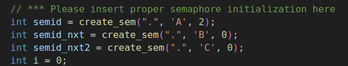
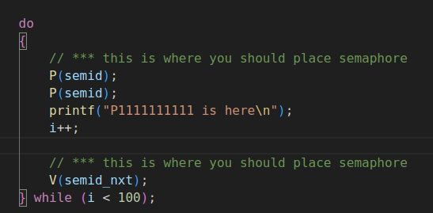
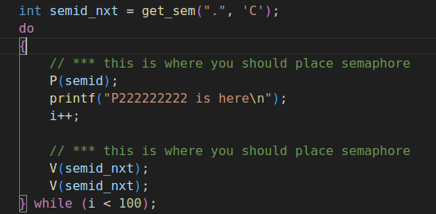
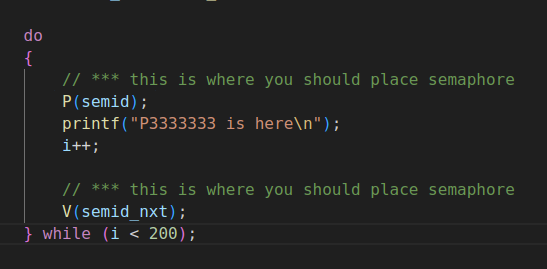
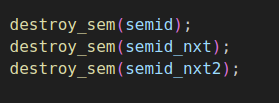

# HW4 Linux Semaphore
> 如何編譯：使用 `makefile` 進行編譯
> 主要執行結果

## 如何編譯 
* 由於題目需要編譯多個 c++ 檔案並且進行執行，方便進行編譯是使用
```makefile
TARGETS = p1 p2 p3 

all: $(TARGETS) # 執行 p1, p2, p3 target 
	./p1 & ./p2 & ./p3& # 執行命令

p1: p1.c
	gcc -o p1 p1.c sem.c # 執行 p1

p2: p2.c
	gcc -o p2 p2.c sem.c # 執行 p2

p3: p3.c
	gcc -o p3 p3.c sem.c # 執行 p3

clean: 
	rm -f $(TARGETS)
```

## 執行
### 修改過程
* 由於必須讓 p1, p2, p3 這三份檔案執行 print 且要依照順序，因此開了 3 個 semaphore 分別是 p1,p2,p3
* 其中必須先讓 `p1.c` 先啟動，所以要先設 p1 semaphore 為 1

* 其中由於 `p3.c` 需要 print 2 次,同時會啟動兩次 `V(p1)`, 因此卡住 `p1.c` 需要用 `P(p1)` 兩次
 
* 因為 `p3.c` 要 print 2 次，因此需要對 p3 semaphore 去做 `V(p3)` 兩次, `p2.c`

* 那 `p3.c` 因為他要 print 2 次，但在 `p2.c` 有啟動兩次 `V(p3)` 因此可以 print 2 次

* 最後要將 semaphore destory 

