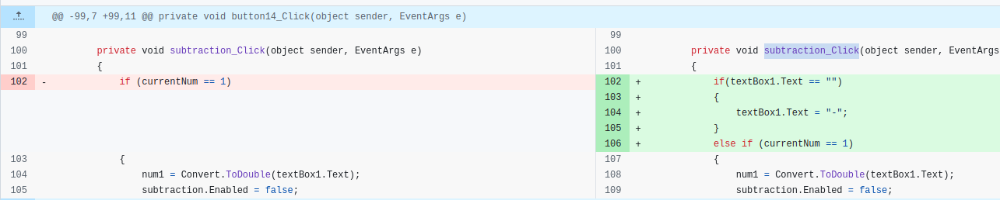
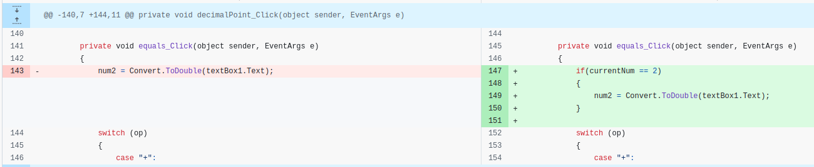
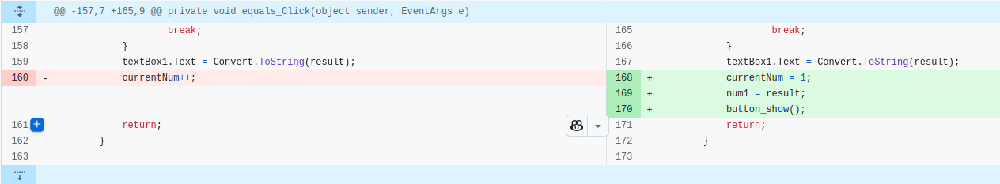
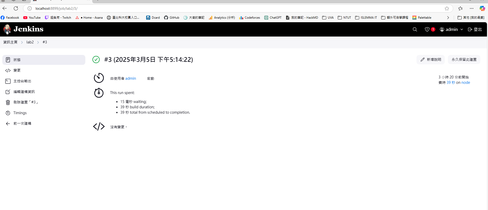
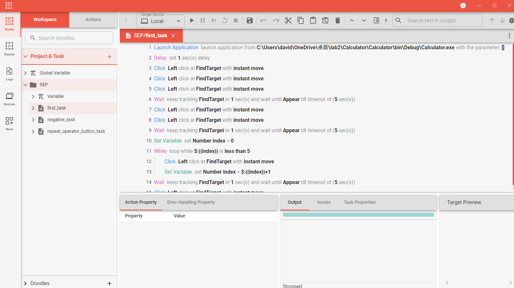

# Lab2： 簡易計算機 Bug 說明文件
> 我是用 ubuntu 上開 qemu 虛擬機上來實做，直接請實驗室同學幫忙用手機錄影
> [執行 jenkins 影片連結](https://www.youtube.com/watch?v=ev-h5bDwPrI&ab_channel=%E5%90%B3%E5%AE%A5%E9%99%9E)
## Bug1: 輸入負數加減法會發生問題
* 場景：當想要輸入 `-3-10` 時會發生問題
* 原因：`subtraction_Click` 在輸入負號時會以為成減法
* 修改成果

## Bug2: 連按等於時, 不會重複最後一步動作
* 場景：當輸入 `10+20=30` 在輸入一次 `=` 後, textbox 會變成 60, 而非 50. 
* 原因：`CurrentNum` 每次都會以為是兩個數字相加, 而不是有可能為 repeat 動作 
* 修改成果

## Bug3: 計算機計算完成後, 使用的運算 button 並不會 enable 回來
* 場景：當輸入完 `1+1=2` 之後, `+` 的 button 會顯示成 disable. 
* 原因：做完運算操作後, 並沒有將 button 改回 enable. 
* 修改成果

## Jenkins 執行完畫面截圖

## Robotive 測試腳本
Robotive 使用三種 Case, 分別是測試 bug2, bug1, bug3. 
* Test Case bug2 會先使用 `120+9` 進行運算後在連續按五次 `=` 去進行連加 9 的動作
* Test Case bug1 則是使用 `-1+3` 進行測試
* Test Case bug3 則是使用 `3+5` 後在輸入 `+6` 來繼續運算 

